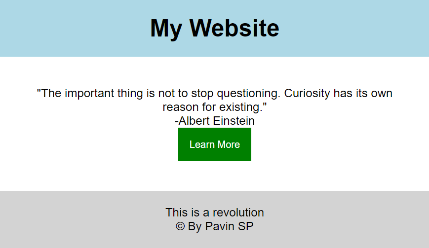
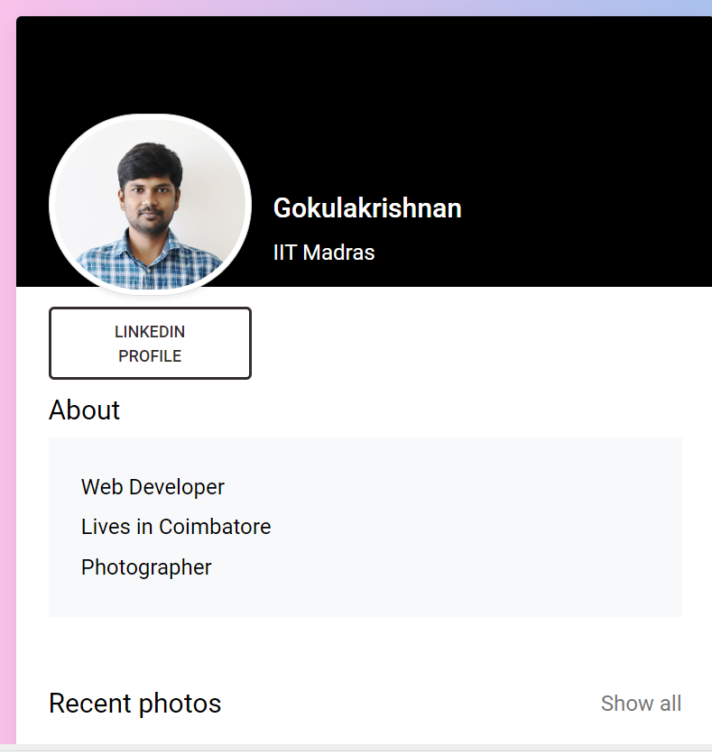
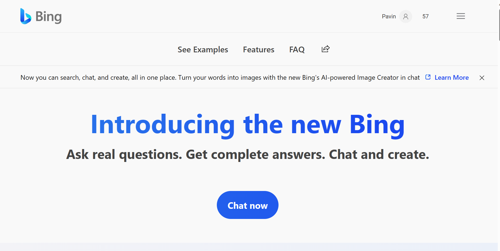
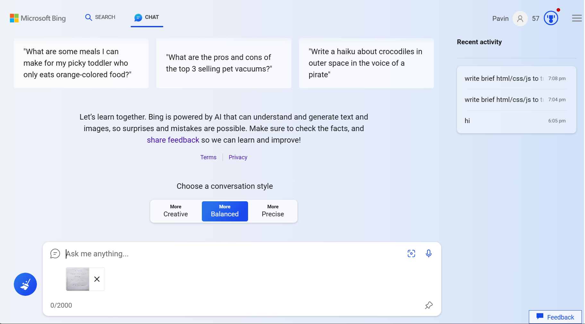
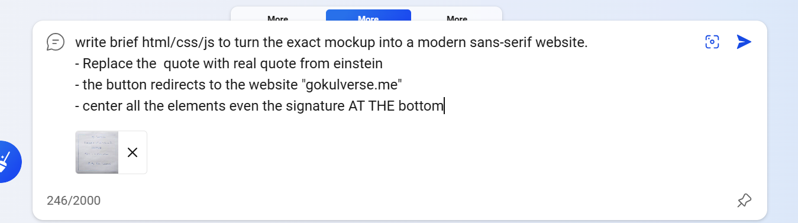
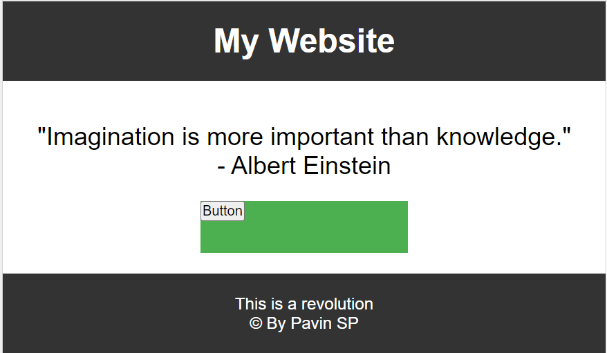
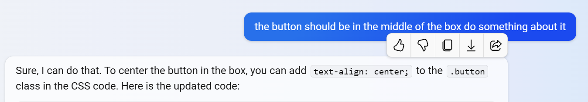
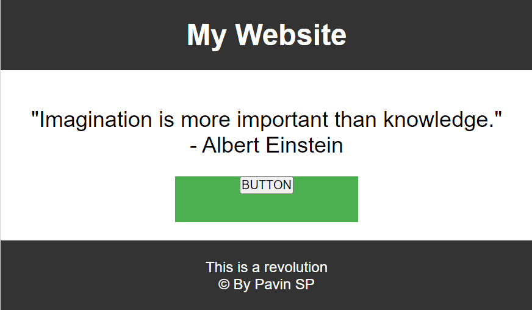

# bingchat




# Explanation:
 - go to bing 
- click on 'chat now'
- drag and drop or upload the image that you want to be as an model for your website in the chatbox

- give the details you want to make changes on the site 
    - for ex:
    ```
    write brief html/css/js to turn the exact mockup into a modern sans-serif website.Replace the  quote with real quote from einstein the button redirects to the website "gokulverse.me" center all the elements even the signature AT THE bottom
    ```
     and hit enter
- the code will be provided soon enough
- you can copy the code and check the output in the html editor(or online html editor)
```
<html>
<head>
<style>
* {
  box-sizing: border-box;
  margin: 0;
  padding: 0;
}

body {
  font-family: Arial, sans-serif;
}

.header {
  background-color: #333;
  color: white;
  text-align: center;
  padding: 20px;
}

.quote {
  font-size: 24px;
  text-align: center;
  margin-top: 40px;
}

.button {
  display: block;
  width: 200px;
  height: 50px;
  margin: 20px auto;
  background-color: #4CAF50;
  color: white;
  border: none;
  cursor: pointer;
  text-align: center; /* added this line */
}

.button:hover {
  background-color: #3A8E3A;
}

.footer {
  background-color: #333;
  color: white;
  text-align: center;
  padding: 20px;
}
</style>
</head>
<body>

<div class="header">
<h1>My Website</h1>
</div>

<div class="quote">
<p>"Imagination is more important than knowledge."</p>
<p>- Albert Einstein</p>
</div>

<div class="button">
<button onclick="redirect()">BUTTON</button>
</div>

<div class="footer">
<p>This is a revolution</p>
<p>© By Pavin SP</p>
</div>

<script>
function redirect() {
  window.location.href = "https://gokulverse.me";
}
</script>
</body>
</html>

```
- 
- make changes if the output is not what you've desired
- 
- the changed html code is:
```
<html>
<head>
<style>
* {
  box-sizing: border-box;
  margin: 0;
  padding: 0;
}

body {
  font-family: Arial, sans-serif;
}

.header {
  background-color: #333;
  color: white;
  text-align: center;
  padding: 20px;
}

.quote {
  font-size: 24px;
  text-align: center;
  margin-top: 40px;
}

.button {
  display: block;
  width: 200px;
  height: 50px;
  margin: 20px auto;
  background-color: #4CAF50;
  color: white;
  border: none;
  cursor: pointer;
  text-align: center; /* added this line */
}

.button:hover {
  background-color: #3A8E3A;
}

.footer {
  background-color: #333;
  color: white;
  text-align: center;
  padding: 20px;
}
</style>
</head>
<body>

<div class="header">
<h1>My Website</h1>
</div>

<div class="quote">
<p>"Imagination is more important than knowledge."</p>
<p>- Albert Einstein</p>
</div>

<div class="button">
<button onclick="redirect()">BUTTON</button>
</div>

<div class="footer">
<p>This is a revolution</p>
<p>© By Pavin SP</p>
</div>

<script>
function redirect() {
  window.location.href = "[[https://gokulverse.me](https://github.com/PavinSP/bingchat/edit/main/README.md)](https://github.com/PavinSP/bingchat/edit/main/README.md)";
}
</script>
</body>
</html>
```
- which outputs as 
- 

- refer the link down below for more clarity
- [linked in post](
https://www.linkedin.com/posts/eric-vyacheslav-156273169_this-is-the-future-llms-can-now-turn-simple-activity-7093992476083974144-8yhH?utm_source=share&utm_medium=member_android
)
