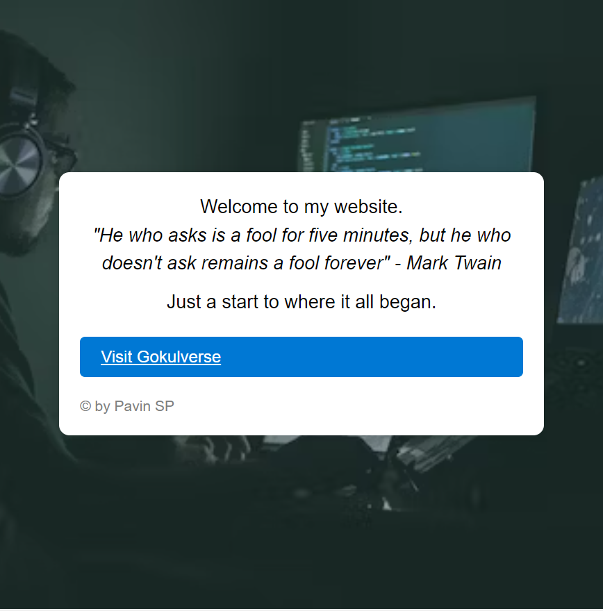

```
<html>
<head>
  <style>
    * {
      margin: 0;
      padding: 0;
      box-sizing: border-box;
    }
    body {
      font-family: Arial, sans-serif;
      background-image: url("https://images.unsplash.com/photo-1510915228340-29c85a43dcfe?ixid=MnwxMjA3fDB8MHxzZWFyY2h8MXx8YWl8ZW58MHx8MHx8&ixlib=rb-1.2.1&auto=format&fit=crop&w=500&q=60");
      background-size: cover;
      background-position: center;
      display: flex;
      flex-direction: column;
      align-items: center;
      justify-content: center;
      min-height: 100vh;
    }
    .container {
      width: 80%;
      max-width: 600px;
      background-color: white;
      border-radius: 10px;
      box-shadow: 0 0 10px rgba(0,0,0,0.1);
      padding: 20px;
    }
    .note {
      font-size: 18px;
      line-height: 1.5;
      text-align: center;
    }
    .quote {
      font-style: italic;
    }
    .author {
      margin-top: 10px;
    }
    .button {
      display: block;
      margin: 20px auto;
      padding: 10px 20px;
      border: none;
      border-radius: 5px;
      background-color: #0078d4;
      color: white;
      font-size: 16px;
    }
    .signature {
      font-size: 14px;
      color: gray;
    }
  </style>
</head>
<body>
  <div class="container">
    <div class="note">
      <p>Welcome to my website.</p>
      <p class="quote">"He who asks is a fool for five minutes, but he who doesn't ask remains a fool forever" - Mark Twain</p>
      <p class="author">Just a start to where it all began.</p>
    </div>
    <a href="https://gokulverse.me" class="button">Visit Gokulverse</a>
    <p class="signature">© by Pavin SP</p>
  </div>
</body>
</html>

```